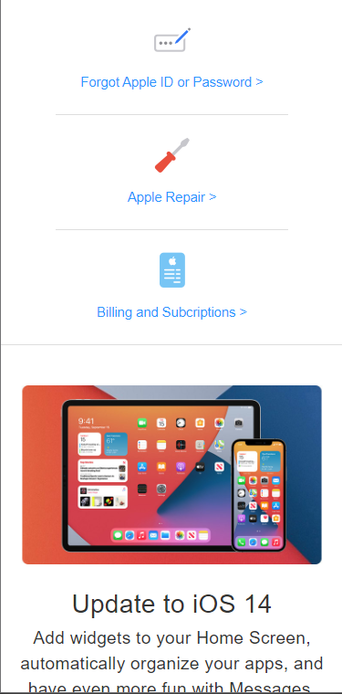

# Procesverslag
**Auteur:** -Fabian Vis-

## Bronnenlijst
1. https://www.w3schools.com/
2. https://dlo.mijnhva.nl/d2l/home/192602
3. https://css-tricks.com/
4. http://sinds1971.nl/
5. https://learncssgrid.com/
6. https://www.apple.com/

## Eindgesprek (week 7/8)

-De laatste twee weken heb ik denk het meeste geleerd van mijn tijd met het vak front end. Ik heb gemerkt dat hoe meer ik de code begreep hoe gemakkelijker en hoe meer plezier ik kreeg van het coderen. Ik heb de laatste twee weken voornamelijk gewerkt aan de support pagina (de tweede pagina). Ik heb het gevoel dat er een duidelijk verschil zit in qua codering bij de 2 pagina's. De homepagina is gemaakt tijdens de eerste weken van front end waar ik nog veel aan het leren was en het nog moeilijk vond. De support pagina is van de laatste 2 weken waar ik al een stuk meer kennis had. Ik heb ervoor gekozen om de home pagina niet super veel aan te passen met de kennis die ik nu heb omdat ik het gevoel heb dat het misschien goed is om te laten zien hoe ik gevorderd ben. Ik ben het meeste trots op hoe ik alles responsive heb gekregen en dan voornamelijk op de supportpagina.

Al met al heb ik echt support veel geleerd van dit vak. Van flexbox tot grid en de accessability voor het web. Ook heb ik ook het gevoel dat ik veel plezier haal uit coderen (als het werkt!).   -

**Screenshot(s):**

## Voortgang 3 (week 6)

### Stand van zaken

-Ik begin er nu lekker in te komen. Ik heb nog wat tutorials over grid en flexbox gekeken en die hebben mij aardig geholpen. Ik loop nog tegen een aantal problemen op maar die wil ik in mijn agenda bespreken-
### Agenda voor meeting
-Fabian
Bij de footer heb ik gebruik gemaakt van grid maar het loopt nog niet helemaal lekker. Ik zou graag een stapje in de goeie richting willen krijgen.

Bij de tweede pagina snijd de afbeelding af als hij kleiner wordt. Hoe krijg ik dit voormekaar? Ook springt de text bij de header in desktop versie in het plaatje in plaats van onder het plaatje.-

### Verslag van meeting
Sanne heeft mij geholpen met responsive maken van het onderste gedeelte van mijn footer. Dit hebben wij gedaan met grid. Tijdens het uitleggen is grid mij een stuk helderder geworden. Verder heeft sanne gezegd dat het afsnijden van een afbeeldingen wordt gedaan met object in css. Dit ga ik toepassen.

**Screenshot(s):**

## Voortgang 2 (week 5)

### Stand van zaken

-Ik moet nogsteeds veel googlen wat veel tijd kost. Ik heb wel het gevoel dat het steeds
beter gaat. Ik zit soms wel vast met een aantal punten omdat apple gecodeerd is door mensen die
vrij goed kunnen coderen. Ik probeer mijn versie dan zoveel mogelijk op het origineel te laten lijken maar dat lukt dus niet altijd. Verder ben ik aardig trots op hoe het mij gelukt is de website responsive te maken.-
### Agenda voor meeting
-Fabian
Het lukt mij niet om de twee atjes op de homepagina naast elkaar te zetten. Dit wil ik graag bespreken.-

### Verslag van meeting
Ik heb van de studentassistenten hulp gekregen met de twee linkjes naast elkaar te zetten. Dit hebben we gedaan
doormiddel van een div. Verder hadden zij niks aan te merken op mijn code.
**Screenshot(s):**

## Voortgang 1 (week 3)

### Stand van zaken

-Ik vond het lastig om weer op te starten met coderen. Het ging aan in het begin sloom maar naarmate ik bezig was ging het was sneller. Het hamburgermenu maken bijvoorbeeld was aardig lastig maar met wat hulp ben ik er gekomen. Verder is het gewoon veel herhalen.-

**Screenshot(s):**

### Agenda voor meeting

-samen met je groepje opstellen-

### Verslag van meeting

-Ik heb veel feedback gekregen over de accessability van voor mensen met screenreaders.
Dit heb ik verbeterd in mijn werk. Verder wat kleine schoonheids foutjes bij de HTML en CSS maar
over het algemeen was mijn code goed.-

## Intake (week 1)

**Je startniveau:** -rood-

**Je focus:** -responsive-

**Je opdracht:** -https://www.apple.com/nl/-

**Screenshot(s):**

**Breakdown-schets(en):**

